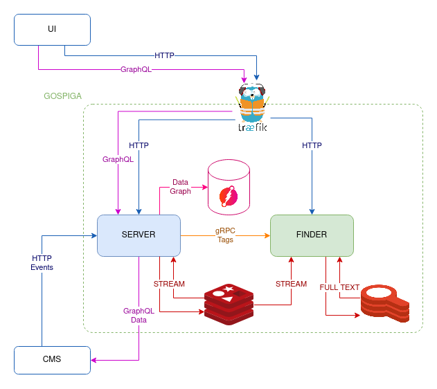

# Gospiga

### [Nospiga](https://gitlab.com/kind84/nospiga) backend in Go

----

### Architecture Overview



### Services

- **Server**
It is responsible of ingesting data coming from the CMS, store it in the graph
database and expose a GraphQL API for the UI to consume.
- **Finder**
Its purpose is to index data for full-text search and expose an API to retrieve
the results.

### Other components

- **[DGraph](dgraph.io)**
Graph database used to store data represented as nodes and edges. This allows
to quickly retrieve all recipes including a given ingredient or recipes under
the same category.
- **[Redis](redis.io)**
Used as: 
    - **Message bus** to communicate events between services using
[Streams](https://redis.io/docs/data-types/streams/).
    - **Full text** indexer using the
      [Redisearch](https://github.com/RediSearch/RediSearch).

### Build the project

```sh
make build
```

### Run the tests

```sh
make test
```

### Run the platform in Docker

```sh
make docker-run
```
